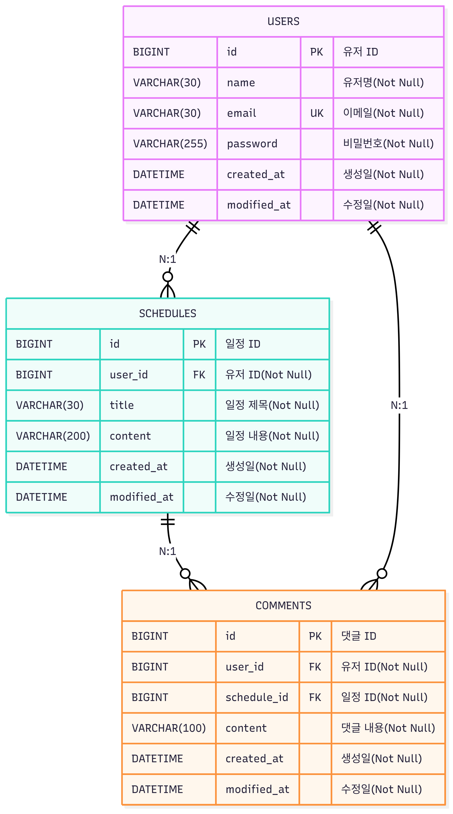

api 명세서

| Method | Endpoint                | Description | Parameters        | Request Body                                            | Response                                                                                                                      | Status Code    | Error Codes                        |
|--------| ----------------------- | ----------- | ----------------- |---------------------------------------------------------| ----------------------------------------------------------------------------------------------------------------------------- | -------------- | ---------------------------------- |
| POST   | /signup                 | 회원가입        | 없음                | { "name": string, "email": string, "password": string } | { "name": string }                                                                                                            | 201 Created    | 400 Bad Request                    |
| POST   | /login                  | 로그인         | 없음                | { "email": string, "password": string }                 | 없음                                                                                                                            | 200 OK         | 401 Unauthorized                   |
| POST   | /logout                 | 로그아웃        | 없음                | 없음                                                      | 없음                                                                                                                            | 204 No Content | 404 Not Found                      |
| GET    | /users                  | 유저 전체 조회    | 없음                | 없음                                                      | { "id": long, "name": string, "email": string, "createdAt": DATETIME, "modifiedAt": DATETIME }                                    | 200 OK         | 404 Not Found                      |
| GET    | /users/{userId}         | 유저 단건 조회    | userId (path)     | 없음                                                      | { "id": long, "name": string, "email": string, "createdAt": DATETIME, "modifiedAt": DATETIME }                                    | 200 OK         | 404 Not Found                      |
| PUT    | /users/{userId}         | 유저 정보 수정    | userId (path)     | { "name": string "password" : string }                  | { "id": long, "name": string, "email": string, "createdAt": DATETIME, "modifiedAt": DATETIME }                                    | 200 OK         | 400 Bad Request   404 Not Found |
| DELETE | /users/{userId}         | 유저 정보 삭제    | userId (path)     | { "password" : string }                                 | 없음                                                                                                                            | 204 No Content | 404 Not Found                      |
| POST   | /schedules              | 일정 생성       | 없음                | { "title": string, "content": string }                  | { "id": long, "userId": long, "name": string, "title": string, "content": string, "createdAt": DATETIME, "modifiedAt": DATETIME } | 201 Created    | 400 Bad Request                    |
| GET    | /schedules              | 일정 전체 조회    | 없음                | 없음                                                      | { "id": long, "userId": long, "name": string, "title": string, "content": string, "createdAt": DATETIME, "modifiedAt": DATETIME } | 200 OK         | 404 Not Found                      |
| GET    | /schedules/{scheduleId} | 일정 단건 조회    | scheduleId (path) | 없음                                                      | { "id": long, "userId": long, "name": string, "title": string, "content": string, "createdAt": DATETIME, "modifiedAt": DATETIME } | 200 OK         | 404 Not Found                      |
| PUT    | /schedules/{scheduleId} | 일정 수정       | scheduleId (path) | { "title": string, "content": string }                  | { "id": long, "userId": long, "name": string, "title": string, "content": string, "createdAt": DATETIME, "modifiedAt": DATETIME } | 200 OK         | 400 Bad Request   404 Not Found |
| DELETE | /schedules/{scheduleId} | 일정 삭제       | scheduleId (path) | { "password" : string }                                 | 없음                                                                                                                            | 204 No Content | 404 Not Found                      |
| POST   | /schedules/{scheduleId} /comments  | 댓글 생성       | scheduleId (path)   | { "content": string }                                   | { "id": long, "userId": long, "scheduleId": long, "content": string, "createdAt": DATETIME, "modifiedAt": DATETIME }              | 201 Created    | 400 Bad Request                    |
| GET    | /comments               | 댓글 전체 조회    | 없음                | 없음                                                      | { "id": long, "userId": long, "scheduleId": long, "content": string, "createdAt": DATETIME, "modifiedAt": DATETIME }              | 200 OK         | 404 Not Found                      |
| GET    | /comments/{commentId}   | 댓글 단건 조회    | commentId (path)  | 없음                                                      | { "id": long, "userId": long, "scheduleId": long, "content": string, "createdAt": DATETIME, "modifiedAt": DATETIME }              | 200 OK         | 404 Not Found                      |
| PUT    | /comments/{commentId}   | 댓글 수정       | commentId (path)  | { "content": string }                                   | { "id": long, "userId": long, "scheduleId": long, "content": string, "createdAt": DATETIME, "modifiedAt": DATETIME }              | 200 OK         | 400 Bad Request   404 Not Found |
| DELETE | /comments/{commentId}   | 댓글 삭제       | commentId (path)  | { "password" : string }                                 | 없음                                                                                                                            | 204 No Content | 404 Not Found                      |

테이블 명세서

| 테이블(users) | 컴럼 | 타입 | 제약       | 설명 |
|------------| --- | --- |----------| --- |
| ID         | id | BIGINT | PK       | 유저 ID |
| name       | name | VARCHAR(30) | Not Null | 유저명 |
| email      | email | VARCHAR(30) | UK,Not Null  | 이메일 |
| password   | password | VARCHAR(100) | Not Null | 비밀번호 |
| createdAt  | created_At | DATETIME | Not Null | 생성일 |
| modifiedAt | modified_At | DATETIME | Not Null | 수정일 |

| 테이블(schedules) | 컴럼 | 타입 | 제약 | 설명 |
|----------------| --- | --- | --- | --- |
| ID             | id | BIGINT | PK | 일정 ID |
| userId         | user_id | BIGINT | FK, Not Null  | 유저 ID |
| title          | title | VARCHAR(30) | Not Null | 일정 제목 |
| content        | content | VARCHAR(200) | Not Null | 일정 내용 |
| createdAt      | created_At | DATETIME | Not Null | 생성일 |
| modifiedAt     | modified_At | DATETIME | Not Null | 수정일 |

| 테이블(comments) | 컴럼 | 타입 | 제약           | 설명 |
|---------------| --- | --- |--------------| --- |
| ID            | id | BIGINT | PK           | 댓글 ID |
| userId        | user_id | BIGINT | FK, Not Null   | 유저 ID |
| scheduleId    | schedule_id | BIGINT | FK, Not Null | 일정 ID |
| content       | content | VARCHAR(100) | Not Null     | 댓글 내용 |
| createdAt     | created_At | DATETIME | Not Null     | 생성일 |
| modifiedAt    | modified_At | DATETIME | Not Null     | 수정일 |

erd
